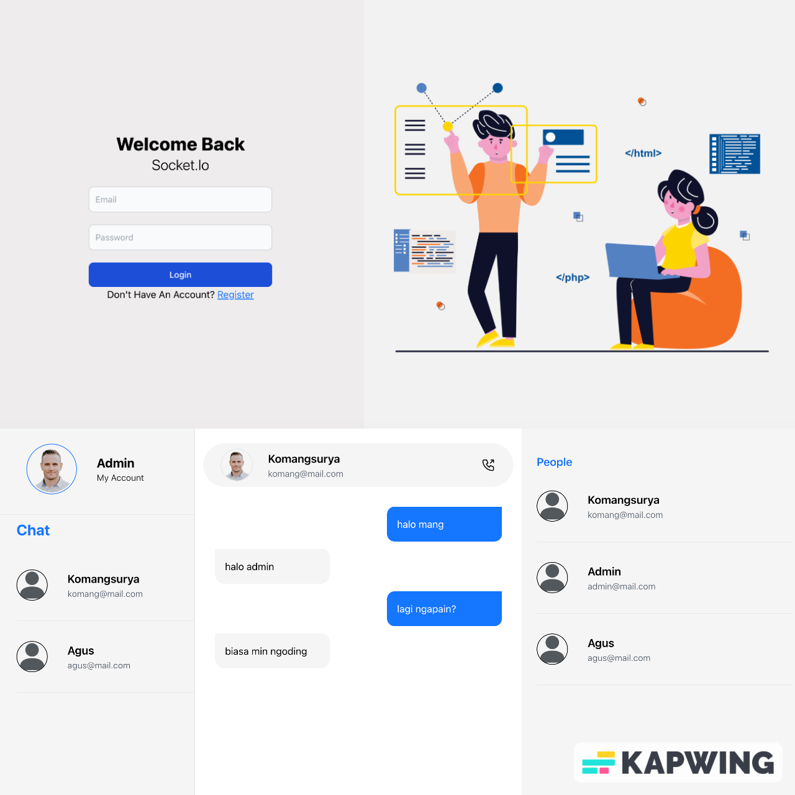

## Step to Start Project

 1. Clone Project
 ```
 git clone https://github.com/komangsurya26/chat_app.git
 ```
 2. Install Dependency Server
 ```
 cd server
 npm install
 ```
 3. Install Dependency Client
 ```
 cd client
 npm install
 ```

 4. Make .env File In Server
 ```
DB_USER = "postgres"
DB_PASSWORD = "<your password db>"
DB_NAME = "real_timechat"
DB_HOST = "<your host>"
SECRET_JWT = ''
 ```
 5. Create New Database
 ```
cd server 
npx sequelize-cli db:create
 ```
 6. Migrate Model Database
 ```
npx sequelize-cli db:migrate
 ```
 7. Start in client
 ```
cd client
npm start
 ```
 8. Start in server
 ```
cd server
npm run dev
 ```
